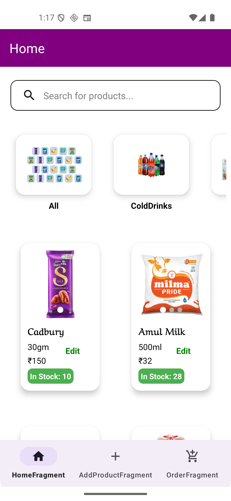
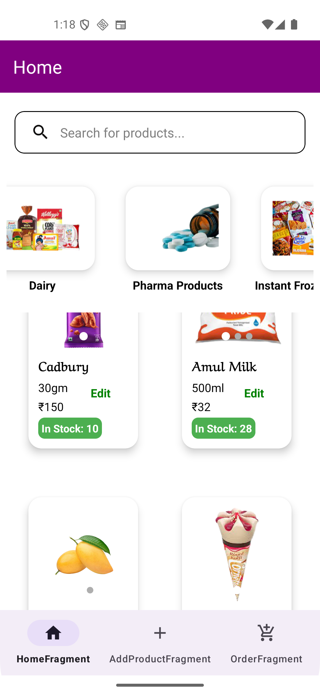
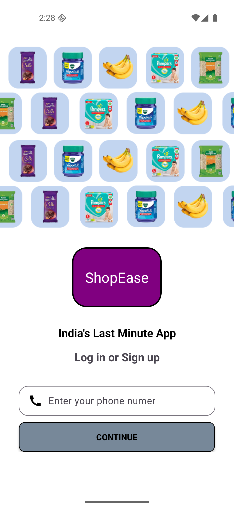
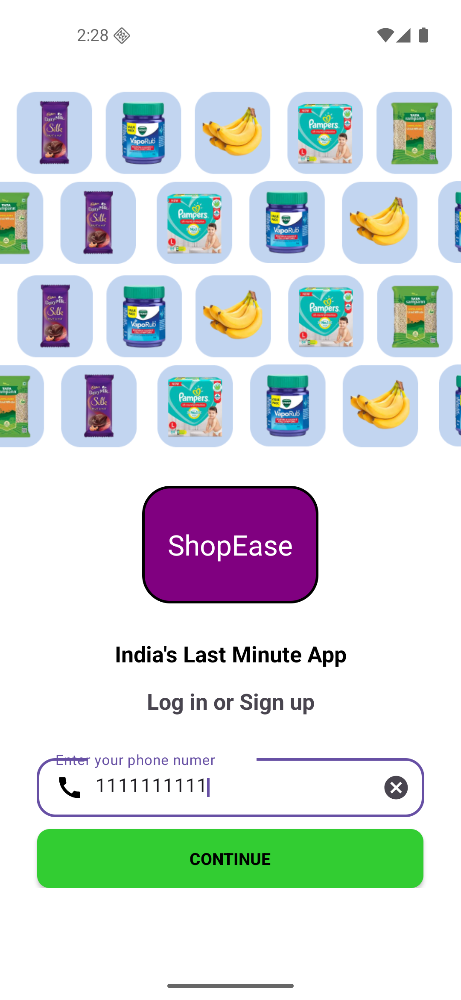
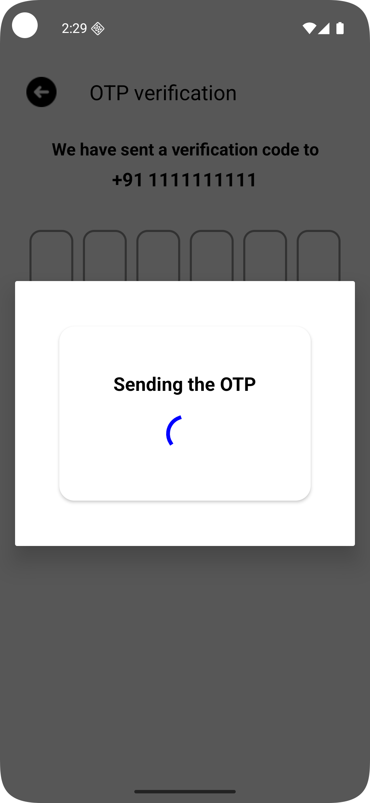
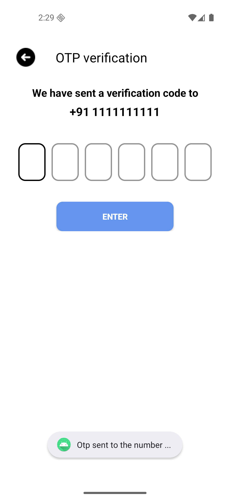
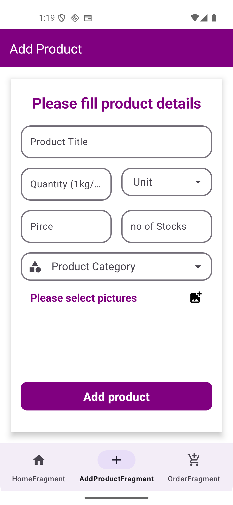
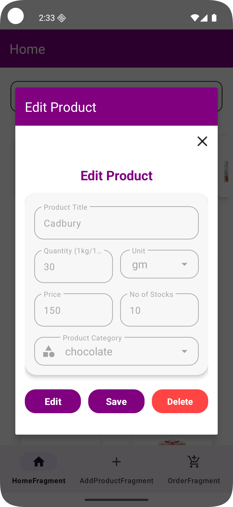
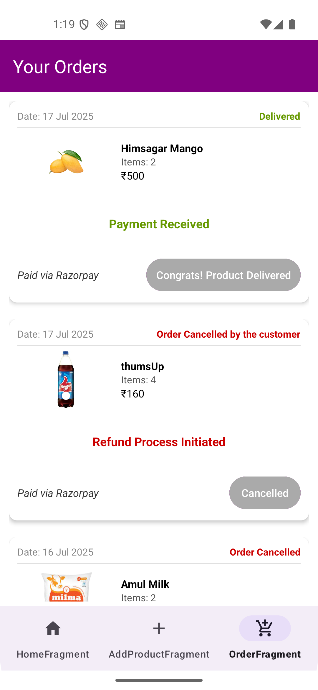

# 🚀 Full-Stack Android eCommerce Solution – Buyer & Seller Apps  
*(This is the Seller version)*  
**Buyer Version** 👉 [ShopEase_frBuyer](https://github.com/101paul/ShopEase_frBuyer)

An end-to-end **native Android eCommerce ecosystem**, designed to deliver a seamless, real-time, and secure experience for both **buyers** and **sellers**.

---

## 📱 Two Apps – One Powerful Ecosystem

  

This project includes **two fully functional Android applications**, built from the ground up:

- 🛒 **Buyer App** – For browsing products, managing cart, placing orders, making secure payments, and tracking delivery  
- 🛍️ **Seller App** – For uploading products, managing stock, and processing incoming orders  

---

## 🛠️ Tech Stack & Architecture

  
  

- **Kotlin + XML** – Modern, fast, and intuitive native UI development  
- **MVVM Architecture** – Clean code separation and lifecycle-aware components  
- **Room Database** – Efficient offline access and persistent cart state  
- **SharedPreferences** – Lightweight local state management  
- **Firebase Realtime Database** – Instant syncing of orders, stock, and product data  
- **Firebase Cloud Storage** – Fast and scalable image uploads & retrieval  

---

## 🔐 Authentication & Security

  
  

- **OTP Login via Firebase Authentication**
  - Secure, passwordless access  
  - Fast mobile number verification  
  - Seamless onboarding for both buyers and sellers
  - 

  
  

---

## 🛍️ Product Management

➕ Add Product

  

Add a new product with title, description, price, stock, and category
Upload up to 5 images with preview support
Automatically updates in Firebase and visible instantly in buyer version
Realtime validation for missing or incorrect data

✏️ Edit Existing Product

   

Tap on any existing product to edit its details
Modify title, description, price, stock, unit, or replace images
Realtime updates reflect immediately for the buyer
Smooth, custom dialog with pre-filled current values

## ⚡ Real-Time Order Sync

  

- Get **live notifications** when a buyer places an order  
- Mark orders as **packed, shipped, delivered**  
- View buyer contact & address details  

---

## ✅ Why This App Stands Out

- 🔥 **Native Android development** – Fast & responsive  
- 📐 **MVVM architecture** – Organized and scalable  
- 🛠️ **Full-stack integration** – From UI to payment  
- 🔐 **Secure & real-time** – Built using Firebase & Spring Boot  
- 🚀 **Ready for production** – Smooth UX for both parties  
- 🌐 **Cloud-powered image and data storage**  
- 💼 **Perfect for local businesses & small sellers**  

---

## 📦 Features At A Glance

| Feature                            | Buyer App ✅ | Seller App ✅ |
|-----------------------------------|--------------|----------------|
| OTP Login                         | ✅           | ✅             |
| Realtime Cart                     | ✅           |                |
| Product Upload & Management       |              | ✅             |
| Product Editing                   |              | ✅             |
| Stock Management                  |              | ✅             |
| Live Order Updates                | ✅           | ✅             |
| Razorpay Payment Gateway          | ✅           |                |
| Order Verification via Backend    | ✅           | ✅             |
| Firebase Sync (Realtime + Images) | ✅           | ✅             |
| Offline Cart Storage (Room)       | ✅           |                |
| 🔍 Product Search (Seller App)     |              | ✅             |
| 📍 Address Management              |              | ✅             |

---

